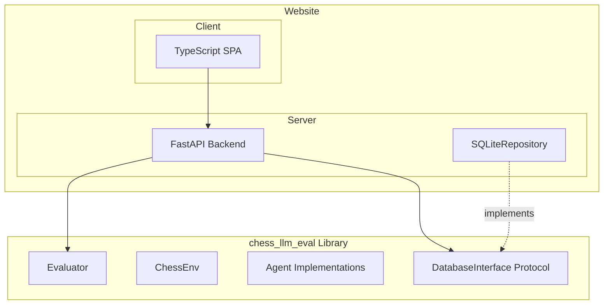
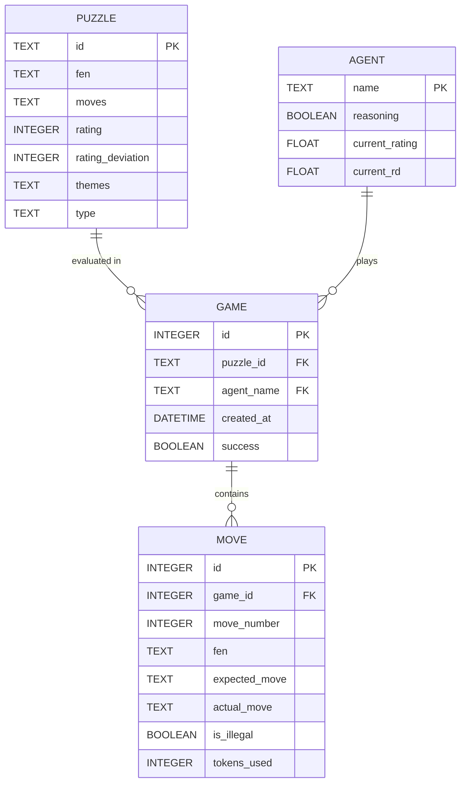

# Chess-LLM Arena Architecture

> **Document Purpose**: System architecture for the Chess-LLM Arena, covering the evaluation library, web backend, and frontend.

---

## High-Level Structure

```
chess-llm/
├── chess_llm_eval/          # Python library (pip installable)
│   ├── agents/              # Agent implementations
│   ├── core/                # Chess environment, evaluation
│   ├── data/                # Database interfaces
│   └── api/                 # LLM provider routing
├── website/
│   ├── server/              # Python FastAPI backend (uses library)
│   └── client/              # TypeScript frontend (Vite)
├── docs/
│   ├── architecture.md
│   ├── roadmap.md
│   └── report.pdf           # Research paper
└── data/
    └── storage.db           # SQLite database
```



---

## Code Quality Standards

### Python (Library + Server)

| Tool     | Purpose              | Configuration                      |
| -------- | -------------------- | ---------------------------------- |
| **Ruff** | Linting + formatting | `pyproject.toml` with strict rules |
| **Mypy** | Static type checking | `--strict` mode enabled            |

**Docstring Requirements** (Google style):

```python
def evaluate_puzzle(
    self,
    puzzle: Puzzle,
    agent: Agent,
    *,
    max_retries: int = 5,
) -> EvaluationResult:
    """Evaluate a single puzzle with the given agent.

    Runs the agent through all moves of the puzzle, tracking correct moves,
    illegal move attempts, and token usage. Updates agent rating via Glicko-2.

    Args:
        puzzle: The puzzle to evaluate, containing FEN and solution moves.
        agent: The agent to evaluate. Must implement the Agent protocol.
        max_retries: Maximum illegal move retries before failing. Defaults to 5.

    Returns:
        EvaluationResult containing success status, moves played, and rating delta.

    Raises:
        AgentError: If the agent fails to respond after max_retries.
        InvalidPuzzleError: If the puzzle data is malformed.
    """
```

### TypeScript (Client)

| Tool           | Purpose                              |
| -------------- | ------------------------------------ |
| **ESLint**     | Linting with strict TypeScript rules |
| **Prettier**   | Code formatting                      |
| **TypeScript** | `strict: true` in `tsconfig.json`    |

---

## Modular Interface Design

> [!IMPORTANT]
> All extension points use **Protocol classes** (Python) or **interfaces** (TypeScript) to enable future replacement without breaking existing code.

### Database Layer

```python
from typing import Protocol

class GameRepository(Protocol):
    """Protocol for game data persistence."""

    async def get_leaderboard(self) -> list[AgentRanking]:
        """Retrieve all agents sorted by rating descending."""
        ...

    async def get_agent_games(self, agent_name: str) -> list[GameSummary]:
        """Retrieve all games for a specific agent."""
        ...

    async def get_game_replay(self, game_id: int) -> GameReplay:
        """Retrieve full move sequence for a game."""
        ...

    async def save_game(self, game: Game) -> int:
        """Persist a new game record. Returns the game ID."""
        ...
```

**Implementations**:

- `SQLiteRepository` - Current MVP implementation
- `PostgresRepository` - Future: concurrent access for live matches
- `InMemoryRepository` - Testing

### Agent Interface

```python
class Agent(Protocol):
    """Protocol for chess-playing agents."""

    @property
    def name(self) -> str:
        """Unique identifier for the agent."""
        ...

    @property
    def rating(self) -> float:
        """Current Glicko-2 rating."""
        ...

    async def get_move(
        self,
        fen: str,
        legal_moves: list[str],
        color: Color,
    ) -> MoveResponse:
        """Generate a move for the given position."""
        ...
```

### LLM Provider Interface

```python
class LLMProvider(Protocol):
    """Protocol for LLM API providers."""

    async def complete(
        self,
        messages: list[Message],
        *,
        model: str,
        temperature: float = 0.0,
    ) -> CompletionResponse:
        """Send a completion request to the LLM."""
        ...
```

**Implementations**:

- `OpenRouterProvider` - Aggregates multiple models
- `OpenAIProvider` - Direct OpenAI access
- `AnthropicProvider` - Direct Anthropic access

---

## Data Model



---

## Library Package Structure

```
chess_llm_eval/
├── __init__.py              # Public API exports
├── py.typed                  # PEP 561 marker
├── agents/
│   ├── __init__.py
│   ├── base.py              # Agent protocol
│   ├── llm.py               # LLMAgent implementation
│   ├── stockfish.py         # StockfishAgent
│   └── random.py            # RandomAgent
├── core/
│   ├── __init__.py
│   ├── chess_env.py         # Board state management
│   ├── evaluator.py         # Puzzle evaluation logic
│   ├── glicko.py            # Rating calculations
│   └── types.py             # Shared type definitions
├── data/
│   ├── __init__.py
│   ├── protocols.py         # Repository protocols
│   ├── sqlite.py            # SQLite implementation
│   └── models.py            # Data classes (Puzzle, Game, Move)
└── providers/
    ├── __init__.py
    ├── base.py              # LLMProvider protocol
    └── openrouter.py        # OpenRouter implementation
```

---

## Website Architecture

### Server (FastAPI)

```
website/server/
├── __init__.py
├── main.py                  # FastAPI app entry
├── config.py                # Environment configuration
├── dependencies.py          # Dependency injection
├── routers/
│   ├── leaderboard.py       # GET /api/leaderboard
│   ├── agents.py            # GET /api/agents/{name}
│   └── games.py             # GET /api/games/{id}
└── schemas.py               # Pydantic response models
```

**API Endpoints**:
| Method | Path | Description |
|--------|------|-------------|
| GET | `/api/leaderboard` | Ranked list of all agents |
| GET | `/api/agents/{name}` | Agent details + game history |
| GET | `/api/games/{id}` | Full game replay data |
| GET | `/api/puzzles/{id}` | Puzzle metadata |

### Client (Vite + TypeScript)

```
website/client/
├── src/
│   ├── main.ts              # App entry
│   ├── router.ts            # Client-side routing
│   ├── api/                 # API client functions
│   ├── components/          # Reusable UI components
│   ├── pages/               # Page components
│   └── types/               # TypeScript interfaces
├── public/
├── index.html
├── tsconfig.json
├── eslint.config.js
└── vite.config.ts
```

**Pages**:
| Route | Component | Description |
|-------|-----------|-------------|
| `/` | `Leaderboard` | Agent rankings table |
| `/agent/:name` | `AgentDetail` | Puzzle history for agent |
| `/replay/:gameId` | `PuzzleReplay` | Interactive board replay |
| `/about` | `About` | Research abstract + paper link |

---

## Security & Performance

- **API Keys**: Environment variables only, never committed
- **Database**: Read-only for web API; write access only via evaluation scripts
- **Rate Limiting**: Per-model limits via `aiolimiter`
- **CORS**: Configured for portfolio subdomain only
- **Caching**: Static leaderboard data cached; invalidate on new evaluations

---

## Future Extension Points

| Component | Current          | Future                                 |
| --------- | ---------------- | -------------------------------------- |
| Database  | SQLite           | PostgreSQL for concurrent live matches |
| Hosting   | Static subdomain | Containerized deployment               |
| Auth      | None             | OAuth for user accounts                |
| Real-time | None             | WebSockets for live games              |
