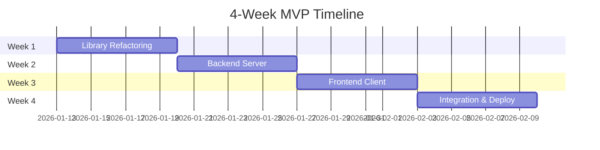

# Chess-LLM Arena Roadmap

> **Target**: Portfolio MVP hosted on subdomain  
> **Timeline**: 4 weeks (January 13 – February 10, 2026)  
> **Paper**: [docs/report.pdf](file:///e:/tuyis/code/School/chess-llm/docs/report.pdf)

---

## Week 1: Library Refactoring (Jan 13–19)

> **Goal**: Extract `modules/` into a clean, typed, documented `chess_llm_eval` library

### 1.1 Project Setup

- [x] Create `pyproject.toml` with:
  - Package metadata
  - Ruff configuration (strict rules)
  - Mypy configuration (`strict = true`)
  - Dev dependencies (pytest, ruff, mypy)
- [x] Add `py.typed` marker for PEP 561 compliance
- [x] Set up pre-commit hooks (ruff, mypy)

### 1.2 Define Interfaces (Protocols)

- [x] `Agent` protocol in `agents/base.py`
- [x] `GameRepository` protocol in `data/protocols.py`
- [x] `LLMProvider` protocol in `providers/base.py`
- [x] Core data models as `@dataclass` in `data/models.py`:
  - `Puzzle`, `Game`, `Move`, `AgentRanking`, `GameReplay`

### 1.3 Refactor Existing Code

- [x] Move `chess_env.py` → `core/chess_env.py`
- [x] Move `evaluator.py` → `core/evaluator.py`
- [x] Move `database_manager.py` → `data/sqlite.py` (implement `GameRepository`)
- [x] Move agents → `agents/` with proper inheritance
- [x] Move router → `providers/openrouter.py` (implement `LLMProvider`)

### 1.4 Documentation & Types

- [x] Add Google-style docstrings to all public functions
- [x] Document all parameters, returns, and exceptions
- [x] Ensure 100% mypy compliance
- [x] Ensure 0 ruff errors

### 1.5 Testing

- [x] Port existing tests to pytest
- [x] Add unit tests for protocols with mock implementations
- [x] Verify `pip install -e .` works locally

### 1.6 Pipeline Validation Run

- [x] Run 3 models (via NVIDIA NIM/OpenRouter) on 3 chess puzzles each
- [x] Verify end-to-end pipeline: Agent → Evaluator → SQLiteRepository
- [x] Store results to verify compatibility with future website backend

**Week 1 Deliverable**: Installable library with clean interfaces, full type coverage, and validated pipeline run.

---

## Week 2: Backend Server (Jan 20–26)

> **Goal**: FastAPI server exposing chess data via REST API

### 2.1 Server Setup

- [x] Create `website/server` directory structure
- [x] Set up FastAPI app with CORS for portfolio subdomain
- [x] Configure Pydantic v2 for request/response schemas
- [x] Add ESLint-equivalent linting (ruff for Python)

### 2.2 API Endpoints

- [x] `GET /api/leaderboard` → List agents by rating
- [x] `GET /api/agents/{name}` → Agent details + game list
- [x] `GET /api/games/{id}` → Full replay with moves
- [x] `GET /api/puzzles/{id}` → Puzzle metadata

### 2.3 Dependency Injection

- [x] Create `dependencies.py` with:
  - `get_repository()` → Returns `SQLiteRepository`
  - Easy swap to PostgreSQL later
- [x] Wire repositories into route handlers

### 2.4 Data Validation

- [x] Define Pydantic schemas in `schemas.py`
- [x] Validate all responses match expected structure
- [x] Add error handling middleware

### 2.5 Testing

- [x] Integration tests with TestClient
- [x] Verify all endpoints return correct data
- [x] Test error cases (404, invalid params)

**Week 2 Deliverable**: Fully functional API serving real data from SQLite

---

## Week 3: Frontend Client (Jan 27 – Feb 2)

> **Goal**: TypeScript SPA with all pages functional

### 3.1 Project Setup

- [x] Create `website/client/` with Vite + TypeScript
- [x] Configure ESLint + Prettier with strict rules
- [x] Set up `tsconfig.json` with `strict: true`
- [x] Add client-side router

### 3.2 API Integration

- [x] Create typed API client in `api/client.ts`
- [x] Define TypeScript interfaces matching backend schemas
- [x] Add loading/error states for all queries

### 3.3 Leaderboard Page (`/`)

- [x] Fetch and render agent rankings
- [x] Display: Rank, Model, Rating ±RD, Win Rate
- [x] Make rows clickable → navigate to agent detail
- [x] Responsive table design

### 3.4 Agent Detail Page (`/agent/:name`)

- [x] Display agent summary (rating, games played, win rate)
- [x] List all puzzles attempted with outcomes
- [x] Filter by puzzle type and outcome
- [x] Paginate results

### 3.5 Puzzle Replay Page (`/replay/:gameId`)

- [x] Integrate chess board library (chessground or chessboardjs)
- [x] Step through moves with keyboard/buttons
- [x] Highlight expected vs actual moves
- [x] Show illegal move attempts
- [x] Display puzzle metadata sidebar

### 3.6 About Page (`/about`)

- [x] Research abstract (from report.pdf)
- [x] Methodology explanation
- [x] Link to full paper PDF
- [x] Author credits

### 3.7 Analytics & Comparison (New)

- [x] Interactive charts for model rating trends (Line Chart)
- [x] Model performance comparison tool (win rates, puzzle type analysis)
- [x] Visualizations based on reports:
  - [x] Model Rating Trends
  - [x] Rating Deviation Trends
  - [x] Percentage of Illegal Moves
  - [x] Puzzle Outcomes by Type

### 3.8 Internationalization (New)

- [/] Implement EN/FR language toggle
- [ ] Multi-language support for all pages
- [ ] Persistent language preference in local storage

**Week 3 Deliverable**: Complete SPA with all 4 pages functional

---

## Week 4: Integration & Polish (Feb 3–10)

> **Goal**: Production-ready deployment on portfolio subdomain

### 4.1 Integration

- [ ] Connect frontend to backend in development
- [ ] Configure production build settings
- [ ] Set up environment variables

### 4.2 UI Polish

- [ ] Consistent design system (colors, typography, spacing)
- [ ] Dark/light mode toggle
- [ ] Smooth page transitions
- [x] Loading skeletons
- [ ] 404 and error pages

### 4.3 Accessibility & SEO

- [ ] Semantic HTML throughout
- [ ] ARIA labels for interactive elements
- [ ] Meta tags (title, description, OpenGraph)
- [ ] Keyboard navigation

### 4.4 Deployment

- [ ] Configure for portfolio subdomain
- [ ] Set up CI/CD (GitHub Actions)
- [ ] Deploy backend (container or serverless)
- [ ] Deploy frontend (static hosting)
- [ ] Verify CORS and API connections

### 4.5 Documentation

- [ ] Update README with live site link
- [ ] Document local development setup
- [ ] Add screenshots to README

**Week 4 Deliverable**: Live portfolio project at `chess.yourdomain.com`

---

## Timeline Overview

---

## Success Criteria

| Criterion     | Target                      |
| ------------- | --------------------------- |
| Library types | 100% mypy strict compliance |
| Library lint  | 0 ruff errors               |
| Frontend lint | 0 ESLint errors             |
| API coverage  | All 4 endpoints functional  |
| Pages         | All 4 pages complete        |
| Deployment    | Live on portfolio subdomain |

---

## Interface Points (Future-Proofing)

| Interface        | Current Impl             | Future Impl             |
| ---------------- | ------------------------ | ----------------------- |
| `GameRepository` | SQLiteRepository         | PostgresRepository      |
| `LLMProvider`    | OpenRouterProvider       | AnthropicProvider, etc. |
| `Agent`          | LLMAgent, StockfishAgent | UserAgent (live play)   |
| Hosting          | Static + SQLite          | Kubernetes + Postgres   |
